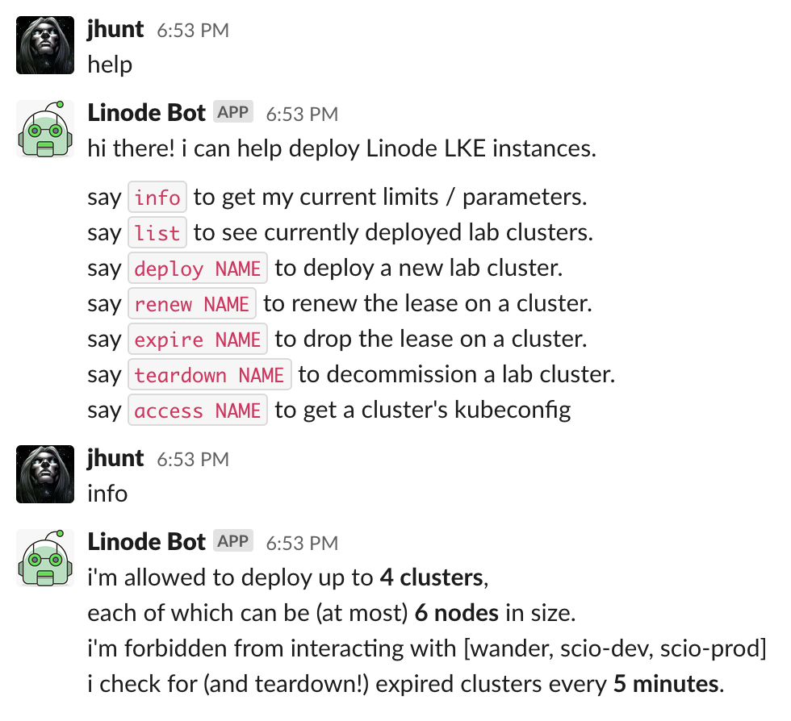
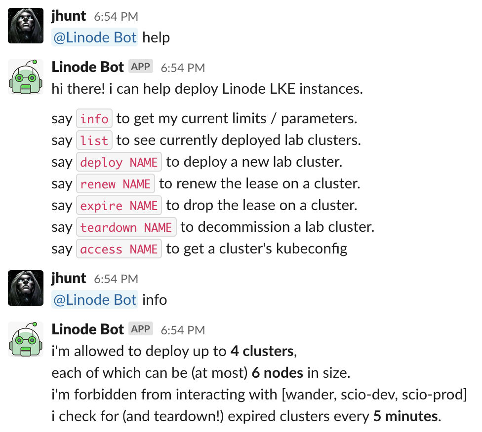
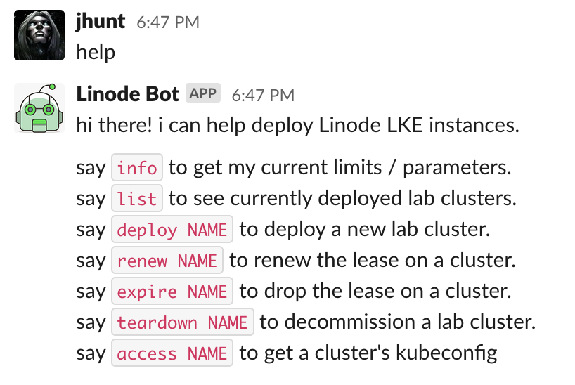
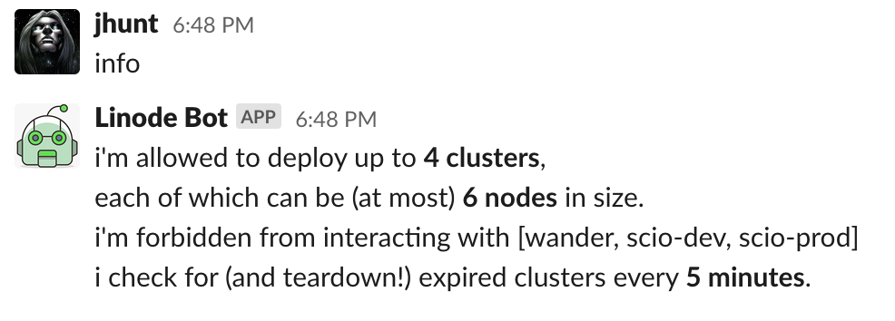
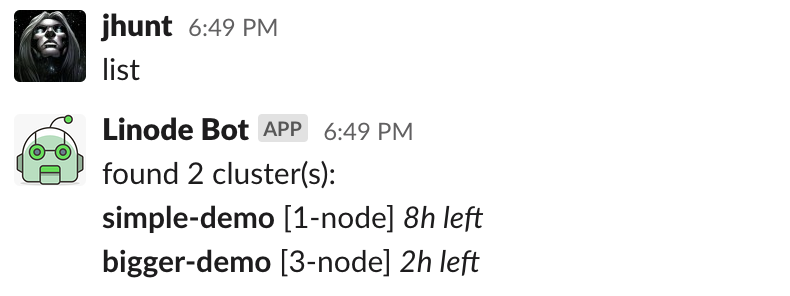
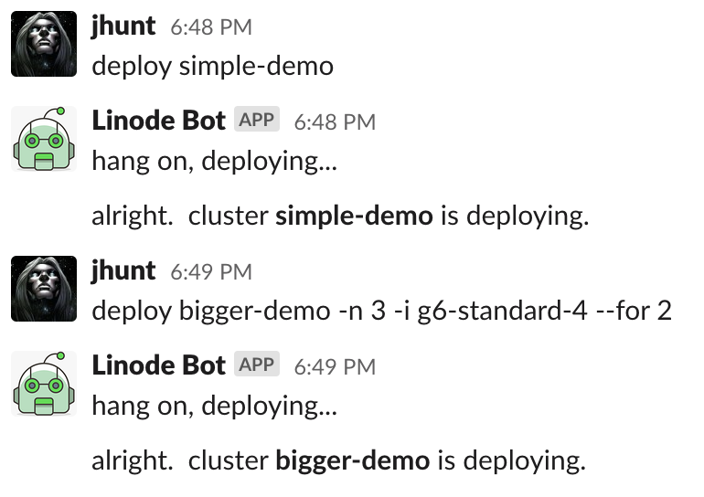
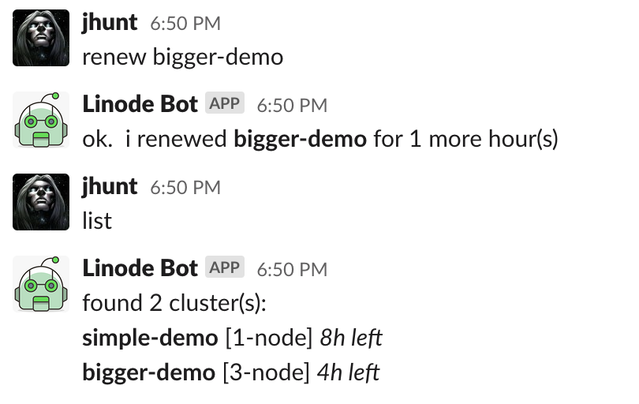
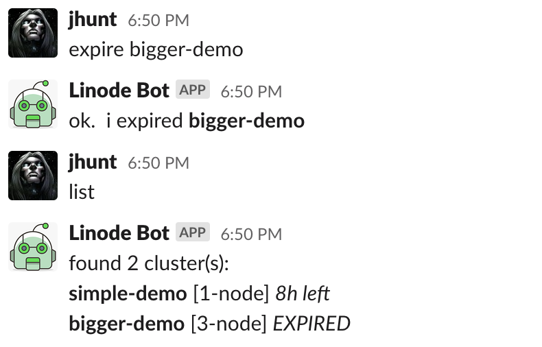
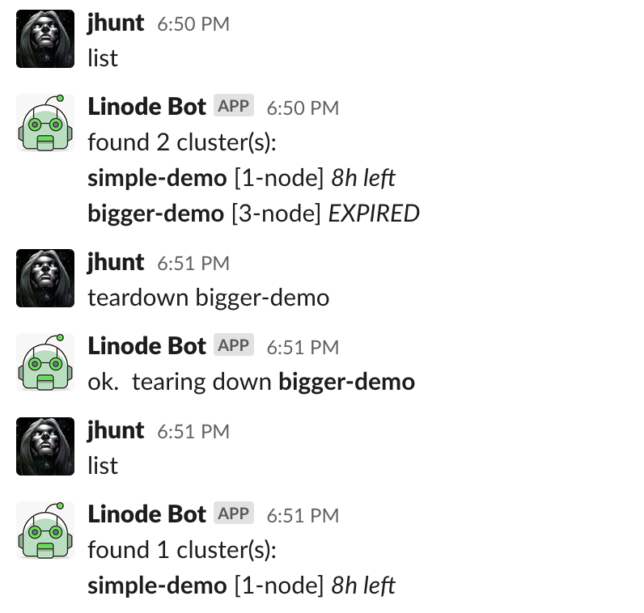
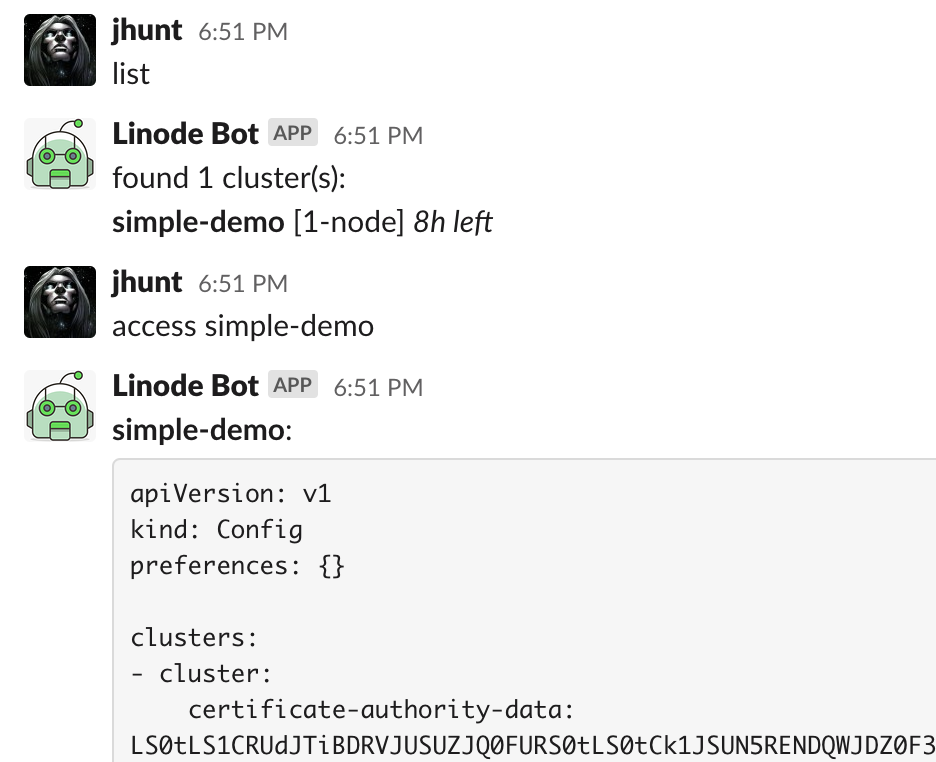

LKEBot -  A Slack Bot for Deploying Lab LKE Clusters
====================================================

This is a Slack Bot for managing a dynamic fleet of
[Linode LKE][1] clusters, with an upper limit on deployment counts
and sizing, geared towards chat-ops teams who want short-lived,
ephemeral Kubernetes clusters for testing and deployment.

Running the Bot
---------------

To run the bot, use the [filefrog/lkebot][2] image,
and your foavorite orchestrator / command-line flags:

    docker run --restart=always -d \
      -e LINODE_TOKEN=$LINODE_TOKEN \
      filefrog/lkebot:latest

Interaction
-----------

In direct one-on-one messages, commands can be sent as-is:

If you invite the bot to a channel, channel members will be able
to interact with it by prefixing the command with a lone @-name:

The following commands are known:

  - `help` - Print a helpful message about known commands.
  - `info` - Print the chatbots configuration.
  - `list` - Print the list of currently deployed clusters.
  - `deploy ...` - Deploy a new cluster.
  - `renew ...` - Renew the lease on a cluster.
  - `expire ...` - Immediately release the lease on a cluster.
  - `teardown ...` - Immediately delete a cluster.
  - `access ...` - Retrieve the $KUBECONFIG for a cluster.

### help

Prints out a helpful reminder of how to interact with the chatbot.

This command takes no arguments.

### info

Prints out the chatbot configuration, including defaults and upper
limits.

This command takes no arguments.

### list

Queries the Linode API (caching the results) and then prints out
the current status of deployed clusters, their sizing, and
expiration times (relatively speaking).

This command takes no arguments.

### deploy

Deploys a new LKE Kubernetes cluster.

Usage:

    deploy NAME [-v K8S-VERSION] [-r REGION] [-i INSTANCE] [-n NODES] [--for HOURS]

The following flags are defined:

  - `-v` or `--version` - The version of Kubernetes to deploy.

  - `-r` or `--region` - The name of the Linode region to deploy
    the LKE cluster into.  This region *must* support
    "Kubernetes".

  - `-i` or `--using` - The name of the Linode instance type to
    deploy in this cluster's node pool.

  - `-n` or `--nodes` - How many worker nodes (pursuant to
    operator-imposed upper limits) to deploy.

  - `--for` - How long (in hours) should this cluster live.

If any or all of these options are omitted, suitable built-in and
operator-provided defaults are used.

### renew

Renew the lease on a deployed cluster.

Usage:

    renew NAME [--for HOURS]

The following flags are defined:

  - `--for` - How many more hours to add onto the clusters lease.
    If not specified, defaults to `1` (hour).

### expire

Immediately expires a cluster's lease, making it sweepable
(without explicitly tearing it down).

Usage:

    expire NAME

This command takes no additional arguments.

### teardown

Immediately tear down a cluster, deleting its worker nodes, and
obliterating all workloads running on it.

Usage:

    teardown NAME

This command takes no additional arugments

### access

Retrieves and prints a suitable KUBECONFIG for accessing this
cluster via the `kubectl` CLI.

Usage:

    access NAME

This command takes no additional arugments

Configuration
-------------

You can configure the bot via either command-line flags or
environment variables.  Here's the list of knobs and levers you
can fiddle with:

  - `$APP_TOKEN` *REQUIRED* - Slack Application token.
    Starts with `xapp-`.

  - `$BOT_TOKEN` *REQUIRED* - Slack Bot token.
    Starts with `xoxb-`.

  - `$LINODE_TOKEN` *REQUIRED* - Linode API token that the chatbot
    will use to deploy and tear down LKE clusters.

  - `$LKEBOT_SWEEP_INTERVAL` - Interval, in minutes, that the bot
    should look for expired clusters, and schedule their
    decommission.  Defaults to `1`; setting it to `0` effectively
    disables sweep logic.

  - `$LKE_MAX_CLUSTERS` - An upper limit on how many LKE
    clusters this chatbot is allowed to deploy.  Defaults to `5`.

  - `$LKE_MAX_NODES` - An upper limit on how big of an LKE
    cluster this chatbot is allowed to deploy.  Defaults to `3`.

  - `$LKE_DEFAULT_REGION` - What Linode region should clusters be
    deployed to if no explicit region is set?  Defaults to
    `us-east`; make sure the region you choose has "Kubernetes"
    available.

  - `$LKE_DEFAULT_INSTANCE` - Instance type to use in the node
    pool for new clusters.  Defaults to `g6-standard-2`; make sure
    the instance type you choose actually exists.

  - `$LKE_DEFAULT_SIZE` - How large of a cluster should the
    chatbot deploy, if no size is explicitly set?  Must not
    execeed the set upper limit for cluster size.

  - `$LKE_DEFAULT_VERSION` - What version of Kubernetes should the
    chatbot deploy, when not told expressly which to use?
    Defaults to `1.22`; make sure the version you specify is known
    to Linode / LKE.

  - `$LKE_DEFAULT_LIFETIME` - How long (in hours) should clusters
    exist for, before the chatbot expires them out and tears them
    down?  Defaults to `8`.  Must be positive and non-zero.

  - `$LKEBOT_OFF_LIMITS` - One (or more) cluster names to
    explicitly prohibit the chatbot from touching, as a
    comma-separated list.  This hs no effect if sweeping is
    disabled.

[1]: https://www.linode.com/products/kubernetes/
[2]: https://hub.docker.com/r/filefrog/lkebot
